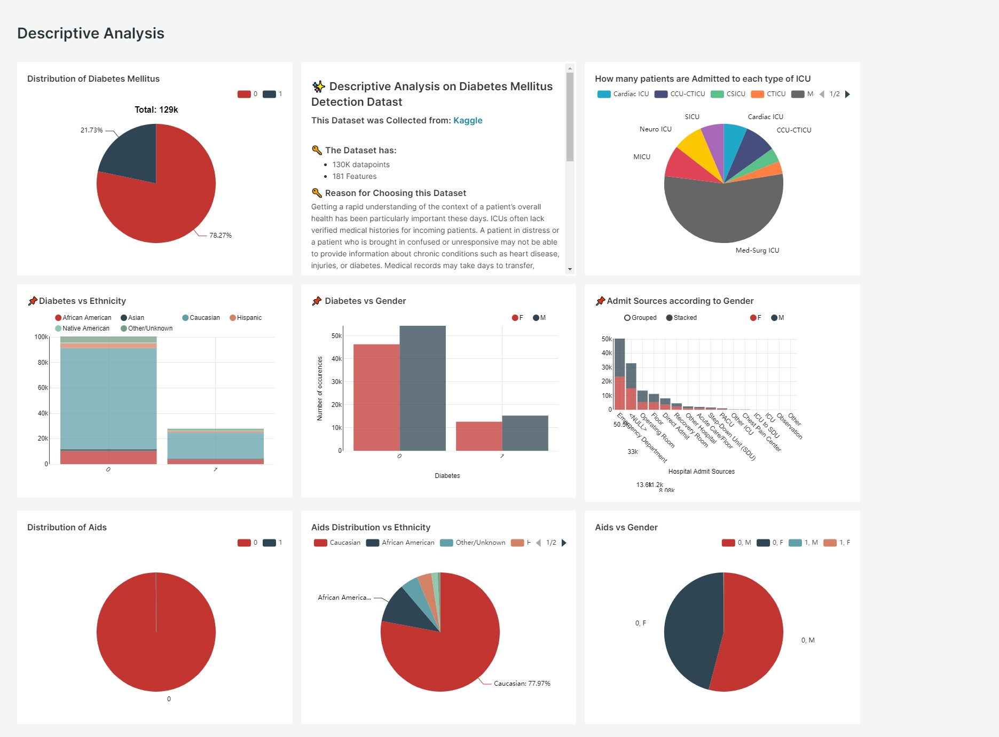

# Diabetese Mellitus Detection

Diabetes mellitus, commonly known as diabetes, is a group of metabolic disorders characterized by a high blood sugar level (hyperglycemia) over a prolonged period of time. There are three main types of diabetes mellitus:

- Type 1 diabetes results from failure of the pancreas to produce enough insulin due to loss of beta cells.
- Type 2 diabetes begins with insulin resistance, a condition in which cells fail to respond to insulin properly.

Gestational diabetes is the third main form and occurs when pregnant women without a previous history of diabetes develop high blood sugar levels. [Source](https://en.wikipedia.org/wiki/Diabetes)

**Dataset Link**: [Kaggle](https://www.kaggle.com/competitions/widsdatathon2021/data)

**Description**: 130K data points, 181 features. The dataset contains the first 24 hours of intensive care data of a patient admitted to an ICU. This is a labeled dataset provided by the WiDS Datathon 2021.

## Steps to run the project

1. Clone the repository.
2. Install the requirements file using `pip install -r requirements.txt`
3. Compose up the superset docker image using:

    ```text
    docker-compose -f docker-compose-non-dev.yml pull
    docker-compose -f docker-compose-non-dev.yml up
    ```

4. To get the saved dashboards, download the folder `db_home` from [here](https://drive.google.com/drive/folders/1NaI-WKBUGU13JBljwj-CnTaUOLRxyLi1?usp=sharing) and put that folder under the `superset` folder.

5. To get the modified dataset for this project, download the files from [here](https://drive.google.com/drive/folders/1GV2YKKKcDYnDteLLiKUlGXUL1hnXTepi?usp=sharing) and put the folder under the `Modified Datasets` folder.

### Login Credentials for Superset

``` text
server: localhost:8088
username: admin
password: admin
```

## Descriptive Analysis


